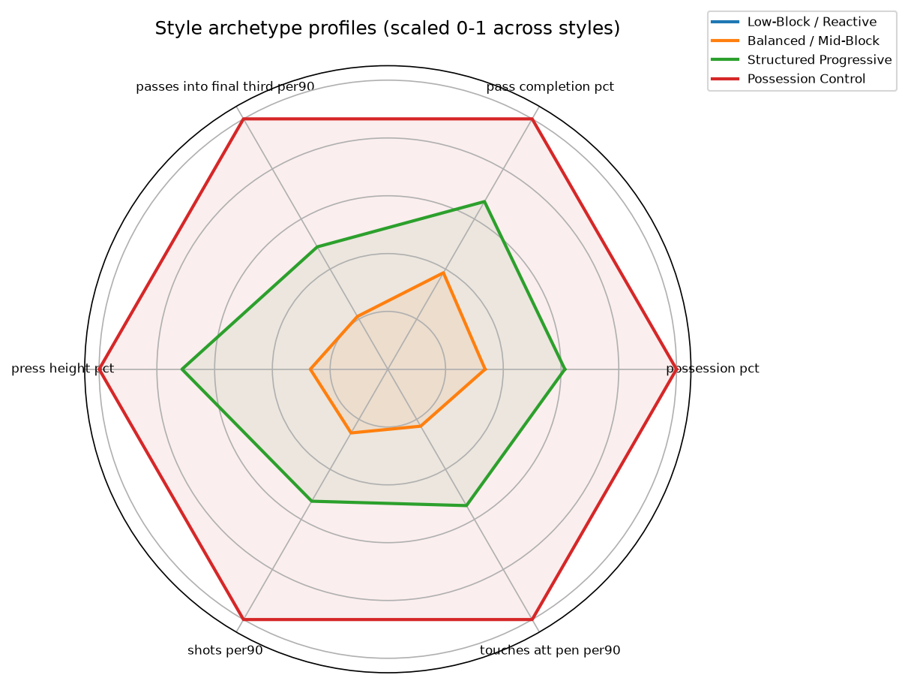
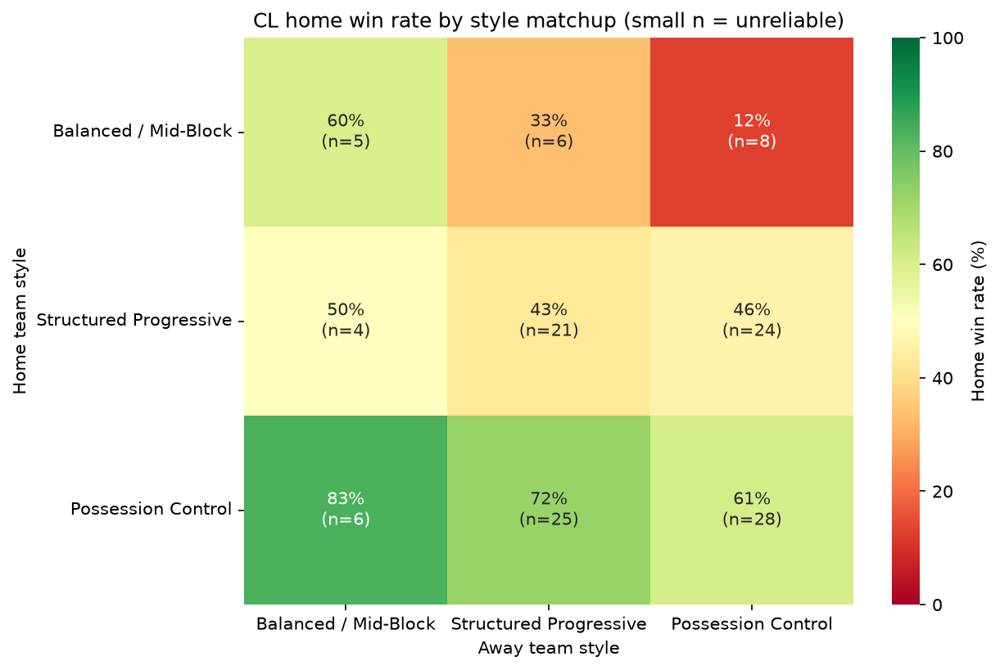
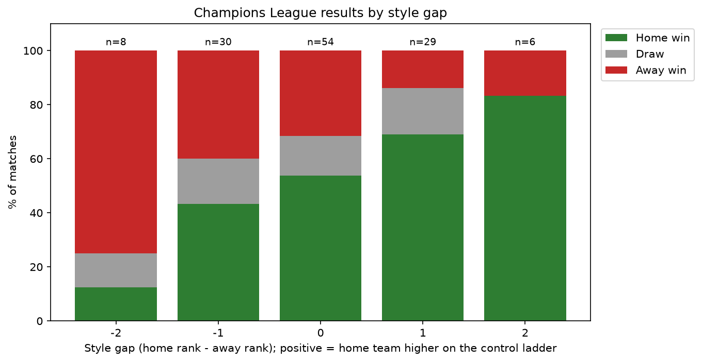

# Champions League Clash of Styles: Methodology & Results

## 1. Question

The Champions League is the one competition where clubs shaped by five different domestic tactical cultures are guaranteed to meet. Pundits often talk about stylistic matchups, like a possession side undone by a team that sits deep and counters. This project asks a testable version of that idea:

**When Big-5 league clubs meet in the Champions League, does their domestic playing style predict the result? Are there "counter" styles, or is it a simple hierarchy?**

## 2. Data

| Source | What it provides | Seasons |
|---|---|---|
| FBref squad stats (via the `soccerdata` package) | Team possession % | 2022-23, 2024-25 |
| Kaggle: *Football Players Stats 2024-2025* (FBref-derived, season totals) | Player passing, defending, possession, shooting | 2024-25 |
| Kaggle: *2022-2023 Football Player Stats* (FBref-derived, per-90 values) | Same categories | 2022-23 (partial season, see Limitations) |
| Kaggle: *UEFA Champions League historical match statistics 2020-2026* | Match results | 2022-23, 2024-25 |

**Why Kaggle instead of scraping FBref directly:** the original plan was to scrape all stats live with `soccerdata`. FBref's bot protection allowed the basic squad table but blocked the detailed passing, possession, and defense pages. The Kaggle files are FBref-derived snapshots of the same stats.

**Leagues:** Premier League, La Liga, Serie A, Bundesliga, Ligue 1. The 2023-24 season was skipped because no complete public player file was available. The 2025-26 player data didn't yet include detailed passing and defense stats.

## 3. Method

### 3.1 Style features

Player stats were summed to team level. Pass completion, for example, is total completions divided by total attempts across the whole squad, rather than an average of player percentages, which would over-weight bench players. Per-90 rates are per team match.

| Feature | What it captures |
|---|---|
| `possession_pct` | Ball dominance |
| `pass_completion_pct` | Control vs. risk in possession |
| `passes_into_final_third_per90` | Territorial progression |
| `press_height_pct` | Share of tackles made in the middle/attacking thirds (a proxy for pressing height; see Limitations) |
| `shots_per90` | Attacking volume |
| `touches_att_pen_per90` | Penetration into the box |

### 3.2 Clustering

The features were standardized and clustered with k-means (k = 4) over 194 team-seasons. Clusters were named by ranking them on average possession:

| Style | Possession | Pass % | Final-third passes/90 | Press height % | Shots/90 | Box touches/90 | Team-seasons |
|---|---|---|---|---|---|---|---|
| Low-Block / Reactive | 43.7 | 75.2 | 24.1 | 48.9 | 10.7 | 17.2 | 67 |
| Balanced / Mid-Block | 49.8 | 79.4 | 28.8 | 51.8 | 12.1 | 20.5 | 66 |
| Structured Progressive | 54.8 | 82.5 | 35.0 | 56.6 | 13.6 | 25.1 | 41 |
| Possession Control | 61.8 | 86.1 | 46.4 | 59.7 | 16.2 | 31.7 | 20 |

Example clubs: **Possession Control** includes Barcelona, PSG, Bayern Munich, and Man City. **Structured Progressive** includes Inter, Dortmund, Brighton, and Chelsea. **Balanced** includes Real Sociedad, Bologna, and Gladbach. **Low-Block** includes Valladolid, Monza, Valencia, and Spezia.

**An important structural finding:** every feature rises together across the clusters. No cluster combines, say, low possession with high pressing. The clusters are therefore less like four distinct tactical philosophies and more like four rungs on a single **possession/control ladder**.

### 3.3 Match dataset

Champions League matches were kept when both clubs were in the style dataset for that season. Club names were matched automatically across sources, for example "Bayer 04 Leverkusen" to "Leverkusen". Result: **127 matches** (51 from 2022-23, 76 from 2024-25). Overall: 54% home wins, 15% draws, 31% away wins.

### 3.4 Analyses

1. **Style matrix:** home win % for every home-style × away-style pair, with the match count for each cell.
2. **Style gap:** each match's gap = home style rank − away style rank (from −3 to +3). A linear regression of home goal difference on style gap.
3. **Predictive check:** 5-fold stratified cross-validation, repeated 20 times. It compares a baseline that always predicts the overall H/D/A rates, a logistic regression on the style pair, and a logistic regression on the style gap alone. Models are compared on accuracy and log loss.

## 4. Results

### 4.1 Style matrix

| Home \ Away | Balanced / Mid-Block | Structured Progressive | Possession Control |
|---|---|---|---|
| **Balanced / Mid-Block** | 60% (n=5) | 33% (n=6) | 12% (n=8) |
| **Structured Progressive** | 50% (n=4) | 43% (n=21) | 46% (n=24) |
| **Possession Control** | 83% (n=6) | 72% (n=25) | 61% (n=28) |

No Low-Block / Reactive club appeared in any CL match against another Big-5 club in these two seasons. Low-possession Big-5 clubs essentially don't reach the competition.

### 4.2 Style gap (headline result)

| Style gap | n | Home win % | Draw % | Away win % | Avg home goal diff |
|---|---|---|---|---|---|
| −2 | 8 | 12.5 | 12.5 | 75.0 | −1.2 |
| −1 | 30 | 43.3 | 16.7 | 40.0 | −0.2 |
| 0 | 54 | 53.7 | 14.8 | 31.5 | +0.5 |
| +1 | 29 | 69.0 | 17.2 | 13.8 | +1.3 |
| +2 | 6 | 83.3 | 0.0 | 16.7 | +2.3 |

**Regression: home goal difference ~ style gap (n = 127)**

- Slope: **+0.82 goals per step** up the style ladder
- Intercept: +0.56 (home advantage when both teams share a style)
- **R² = 0.158**
- **p < 0.0001**

### 4.3 Predictive check

| Model | Accuracy (mean ± sd) | Log loss (mean ± sd) |
|---|---|---|
| Baseline (overall H/D/A rates) | 0.535 ± 0.015 | 0.983 ± 0.018 |
| Style-pair model | 0.538 ± 0.069 | 0.982 ± 0.065 |
| Style-gap model | **0.565 ± 0.071** | **0.948 ± 0.060** |

## 5. Discussion

**The answer to "which styles beat which" is a hierarchy, not rock-paper-scissors.** Results move steadily with the style gap: home sides two rungs *below* their opponent won 12.5% of the time, and home sides two rungs *above* won 83%. The regression is highly significant. Each rung is worth about 0.8 goals, and the style gap explains about 16% of the variation in goal difference, which is meaningful in a sport where single results are this noisy. No cell in the matrix suggests a lower-ranked style reliably beating a higher-ranked one.

**The simple gap model beat the detailed style-pair model.** Knowing only *how far apart* two teams are on the ladder predicted better (lowest log loss) than knowing their exact style labels. The extra detail mostly added noise with 127 matches, which is further evidence that the ladder, not specific pairings, is what matters.

**The predictive edge is real but small.** Accuracy improved by 3 percentage points over the baseline, which is inside one standard deviation across folds. Log loss improved more consistently. Style shifts win probabilities in a useful way but doesn't make individual matches predictable.

**The biggest caveat: style here is tangled up with quality.** The Possession Control cluster is made up of the richest, strongest squads in Europe. Because all six features rise together, this analysis can't separate "possession-dominant play wins" from "the best teams also dominate possession." The honest conclusion is that **a team's place on the possession/control ladder is a strong signal of CL results; whether the style itself causes the wins remains open.**

## 6. Limitations

- **Style is confounded with team strength** (see Discussion). A natural extension is adding a strength measure, such as domestic points per game or Elo, and testing whether the style gap still matters after controlling for it.
- **The 2022-23 player file is a mid-season snapshot.** Its highest player total is 23 full matches vs. about 38 for a complete season, so it was likely captured around February 2023. The style rates (percentages and per-90 values) are still usable but noisier than a full season.
- **Two seasons, 127 matches.** Some matrix cells have fewer than 10 matches and shouldn't be over-interpreted. The style-gap analysis is more reliable because it pools all matches.
- **`press_height_pct` is a proxy, not true PPDA** (passes allowed per defensive action). It measures *where* tackles happen, not how intensely a team presses.
- **Domestic style is assumed to carry into Europe.** Teams sometimes adjust tactics against stronger CL opponents, and that adjustment isn't captured here.
- **Only Big-5 clubs are included.** Matches involving clubs from Portugal, the Netherlands, Scotland, and elsewhere were excluded because comparable style data wasn't collected for those leagues.
